Query code and execution:

**NLQ1:**
```
SELECT 
    l.city,
    -- Step 3: Determining price category dynamically using the library code structure
   CASE 
WHEN (ai.ollama_embed('mxbai-embed-large', 'cheap', host =>    'http://pgai-ollama:11434')::vector <=> ol.review_embedded) <         (ai.ollama_embed('mxbai-embed-large', 'fair', host => 'http://pgai-ollama:11434')::vector <=> ol.review_embedded)
                     AND 
 (ai.ollama_embed('mxbai-embed-large', 'cheap', host => 'http://pgai-ollama:11434')::vector <=> ol.review_embedded) <          (ai.ollama_embed('mxbai-embed-large', 'expensive', host => 'http://pgai-ollama:11434')::vector <=> ol.review_embedded)
                THEN 'cheap'
 WHEN (ai.ollama_embed('mxbai-embed-large', 'fair', host => 'http://pgai-ollama:11434')::vector <=> ol.review_embedded) <                      (ai.ollama_embed('mxbai-embed-large', 'expensive', host => 'http://pgai-ollama:11434')::vector <=> ol.review_embedded)
                THEN 'fair'
                ELSE 'expensive'
        END AS price_category,
    -- Finalizing Q with requested aggregation operators and physical attributes
   AVG(ol.unit_price) AS average_unit_price,
    SUM(ol.quantity) AS total_quantity_ordered

FROM order_Line ol
JOIN location l ON ol.restaurant_id = l.restaurant_id
JOIN time t ON ol.date_id = t.date_id

WHERE 
    t.month = 'March' 
    AND t.year = 2025

GROUP BY 
    l.city,
    price_category;
```
    
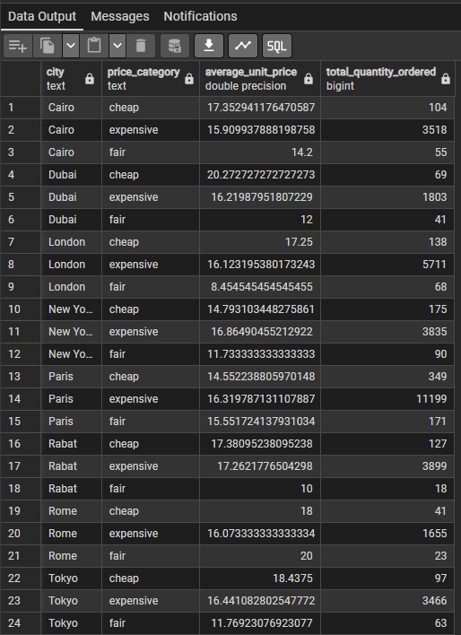


=========================================================================================================

**NLQ2:**
```
SELECT 
    t.year,
    ol.restaurant_id,
     -- Step 3: AI-based Text Aggregation Operator (Summarization-text code injected exactly)
    (ai.openai_chat_complete(
        'llama-3.1-8b-instant',
        jsonb_build_array(
            jsonb_build_object(
                'role', 'user', 
                'content', 'give me one line summary ' || STRING_AGG(ol.review, ', ')
            )
        )
    )->'choices'->0->'message'->>'content' )::text AS customer_reviews_summary

FROM order_Line ol
JOIN time t ON ol.date_id = t.date_id

WHERE 
    -- Filtering physical constraints
    t.month = 'March' 
    AND t.year = 2025

GROUP BY 
    t.year,
    ol.restaurant_id;'''
```
    
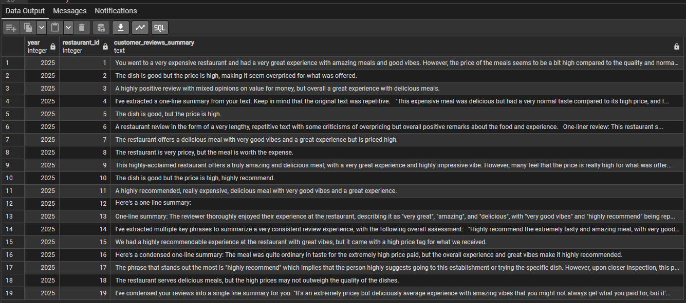

=========================================================================================================

 **NLQ3:**
```
SELECT 
    t.month,
    -- Finalizing Q with requested physical counts
    COUNT(DISTINCT ol.order_id) AS number_of_orders

FROM order_Line ol
JOIN time t ON ol.date_id = t.date_id
JOIN location l ON ol.restaurant_id = l.restaurant_id

WHERE 
    -- Step 3: Image filtering using the Image Embedding Similarity library code exactly
    ai.ollama_embed(
        'nomic-embed-text',
        'terrace',
        host => 'http://pgai-ollama:11434'
    )::vector <=> l.restaurant_picture_embedded < 0.4

GROUP BY t.month;
```


 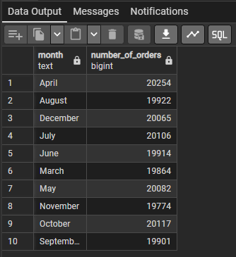


=========================================================================================================

 **NLQ4:**

```
WITH Restaurant_Continent_Lookup AS (
    SELECT 
        restaurant_id,
        country,
        COALESCE(
            (REGEXP_MATCH(
                (ai.openai_chat_complete(
                    'llama-3.1-8b-instant', 
                    jsonb_build_array(
                        jsonb_build_object(
                            'role', 'user', 
                            'content', 'Identify the continent for the country' || country
                        )
                    )
                )->'choices'->0->'message'->>'content')::text, 
                '[a-zA-Z\s]+'
            ))[1],
            'Unknown' 
        )::text AS virtual_continent
    FROM (
        SELECT DISTINCT restaurant_id, country FROM location
    ) AS unique_locations
)
SELECT 
    rcl.virtual_continent,
    t.month,
    AVG(ol.quantity) AS average_quantity_ordered
FROM order_Line ol
JOIN time t ON ol.date_id = t.date_id
JOIN Restaurant_Continent_Lookup rcl ON ol.restaurant_id = rcl.restaurant_id
GROUP BY 
    rcl.virtual_continent,
    t.month;
```

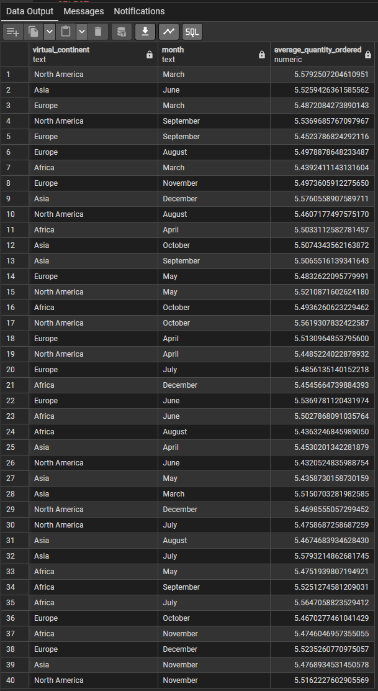
     
=========================================================================================================

 **NLQ5:**

```
SELECT 
    ol.restaurant_id,
    -- Finalizing Q with requested physical aggregation operator
    SUM(ol.amount) AS total_amount_spent

FROM order_Line ol

WHERE 
    -- Step 3: Filtering using the Text Embedding Similarity library code exactly
    ai.ollama_embed(
        'mxbai-embed-large',
        'expensive',
        host => 'http://pgai-ollama:11434'
    )::vector <=> ol.review_embedded < 0.4

GROUP BY 
    ol.restaurant_id;
```

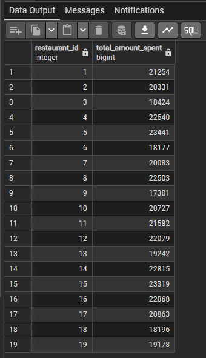


=========================================================================================================

 **NLQ6:**

```
SELECT 
    -- Finalizing Q with requested physical aggregation operator
    SUM(ol.quantity) AS total_quantity

FROM order_Line ol
JOIN time t ON ol.date_id = t.date_id
JOIN dish d ON ol.dish_id = d.dish_id
JOIN location l ON ol.restaurant_id = l.restaurant_id

WHERE 
    -- Filtering physical constraints
    t.year = 2025
    AND d.dish_name = 'Burger'
       -- Step 3: Text filtering using the Text Embedding Similarity library code exactly
    AND ai.ollama_embed(
        'mxbai-embed-large',
        'romantic',
        host => 'http://pgai-ollama:11434'
    )::vector <=> l.restaurant_description_embedded < 0.4;
```
  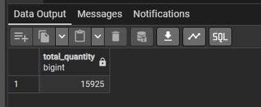


  =========================================================================================================


   **NLQ7:**
```
SELECT 
    ol.restaurant_id,
    -- Finalizing Q with requested physical aggregation operator
    AVG(ol.unit_price) AS average_price

FROM order_Line ol
JOIN dish d ON ol.dish_id = d.dish_id

WHERE 
    -- Filtering physical constraints
    d.dish_name = 'Pizza'
    -- Evaluating if the picture taken by the client is visually similar to the official picture
    -- Using the associated embedding columns and the distance threshold (< 0.4) established in the library
    AND ol.dish_picture_embedded <=> d.dish_picture_embedded < 0.4

GROUP BY 
    ol.restaurant_id;
```
  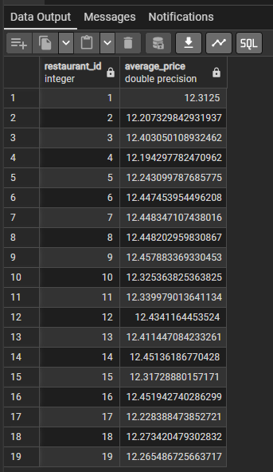


=========================================================================================================


   **NLQ8:**

```
SELECT 
    -- Step 3: AI-based Text Aggregation Operator (Summarization-text code injected exactly)
    (ai.openai_chat_complete(
        'llama-3.1-8b-instant',
        jsonb_build_array(
            jsonb_build_object(
                'role', 'user', 
                'content', 'give me one line summary ' || STRING_AGG(l.restaurant_description, ', ')
            )
        )
    )->'choices'->0->'message'->>'content' )::text AS romantic_restaurants_summary

FROM location l

WHERE 
    -- Step 3: Text filtering using the Text Embedding Similarity library code exactly
    ai.ollama_embed(
        'mxbai-embed-large',
        'romantic',
        host => 'http://pgai-ollama:11434'
    )::vector <=> l.restaurant_description_embedded < 0.4;
```
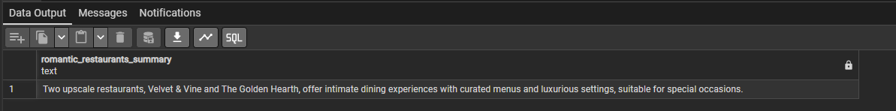

=========================================================================================================

   **NLQ9:**

```
 WITH Restaurant_Continent_Lookup AS (
    SELECT 
        restaurant_id,
        country,     
        COALESCE(
            (REGEXP_MATCH(
                (ai.openai_chat_complete(
                    'llama-3.1-8b-instant', 
                    jsonb_build_array(
                        jsonb_build_object(
                            'role', 'user', 
                            'content', 'Identify the continent for the country:' || country
                        )
                    )
                )->'choices'->0->'message'->>'content')::text, 
                '[a-zA-Z\s]+'
            ))[1],
            'Unknown' 
        )::text AS virtual_continent
    FROM (
        -- Select unique countries linked to their restaurant IDs to avoid duplicate LLM invocations
        SELECT DISTINCT restaurant_id, country FROM location
    ) AS unique_locations
)
SELECT 
    rcl.virtual_continent,
    d.dish_name,  
    -- Finalizing Q with requested physical aggregation operator
    SUM(ol.quantity) AS total_quantity_ordered

FROM order_Line ol
JOIN dish d ON ol.dish_id = d.dish_id
JOIN Restaurant_Continent_Lookup rcl ON ol.restaurant_id = rcl.restaurant_id

WHERE 
    ai.ollama_embed(
        'mxbai-embed-large',
        'very expensive',
		 host => 'http://pgai-ollama:11434'
    )::vector <=> ol.review_embedded < 0.4

GROUP BY 
    rcl.virtual_continent,
    d.dish_name;
```
   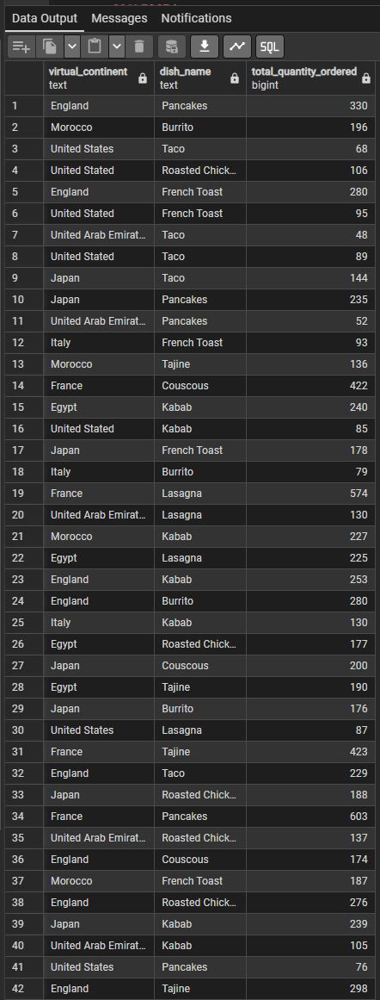


   ========================================================================================================= 

  **NLQ11:**


```
WITH OrderContext AS (
    SELECT ol.unit_price, l.country, d.dish_name, ol.order_id, ol.quantity, l.city
    FROM order_line ol
    JOIN location l ON ol.restaurant_id = l.restaurant_id
    JOIN dish d ON ol.dish_id = d.dish_id
    JOIN time t ON ol.date_id = t.date_id
    WHERE t.month = 'March' AND t.year = 2025
),
UniquePricePoints AS (
    SELECT DISTINCT dish_name, country, unit_price
    FROM OrderContext
),
PriceClassification AS (
    SELECT 
        dish_name, country, unit_price,
        (ai.openai_chat_complete(
            'llama-3.1-8b-instant',
            jsonb_build_array(
                jsonb_build_object(
                    'role', 'user', 
                    'content', format('Classify price as "cheap", "expensive", or "fair" for %s in %s. Price: %s. Respond with one word.', dish_name, country, unit_price)
                )
            )
        )->'choices'->0->'message'->>'content')::text AS raw_category
    FROM UniquePricePoints
)
SELECT 
    oc.city,
    NULLIF(REGEXP_REPLACE(LOWER(pc.raw_category), '[^a-z]+', '', 'g'), '') AS price_category,
    AVG(oc.unit_price) AS average_unit_price,
    SUM(oc.quantity) AS total_quantity_ordered
FROM OrderContext oc
JOIN PriceClassification pc 
  ON oc.dish_name = pc.dish_name 
 AND oc.country = pc.country 
 AND oc.unit_price = pc.unit_price
GROUP BY oc.city, price_category;
```
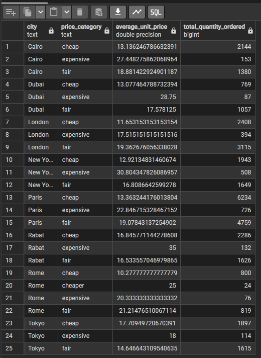


   ========================================================================================================= 

 **NLQ12:**

```
SELECT 
    -- Step 3: Applying Image Embedding Similarity library code conditionally to derive the virtual level
    CASE 
        WHEN ai.ollama_embed(
            'nomic-embed-text',
            'outdoor',
            host => 'http://pgai-ollama:11434'
        )::vector <=> l.restaurant_picture_embedded < 0.4 THEN 'outdoor'
        ELSE 'indoor'
    END AS restaurant_type,  
    -- Finalizing Q with remaining physical aggregation operator
    AVG(ol.unit_price) AS average_unit_price

FROM order_Line ol
JOIN location l ON ol.restaurant_id = l.restaurant_id

GROUP BY 
    restaurant_type;
```
   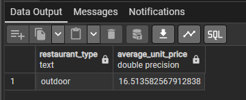

========================================================================================================= 


**Query:Find  the average number of orders for restaurants located close to the sea**


``` 
WITH sea_side_restaurants AS (
    SELECT 
        restaurant_id
    FROM 
        location
    WHERE 
        -- Applying the Text Embedding Similarity library function
        ai.ollama_embed(
            'mxbai-embed-large',
            'close to the sea',
            host => 'http://pgai-ollama:11434'
        )::vector <=> restaurant_description_embedded < 0.4
),
orders_per_restaurant AS (
    SELECT 
        o.restaurant_id,
        COUNT(DISTINCT o.order_id) AS total_orders
    FROM 
        order_Line o
    JOIN 
        sea_side_restaurants r ON o.restaurant_id = r.restaurant_id
    GROUP BY 
        o.restaurant_id
)
SELECT 
    AVG(total_orders) AS average_orders_near_sea
FROM 
    orders_per_restaurant;
```


========================================================================================================= 


**Query:Find  the total quantity for cities having less than 50000 population**


``` 
WITH city_populations AS (
    SELECT DISTINCT
        city,
        -- Strict sanitization block applied to the LLM mathematical selection
        CAST(
            REGEXP_REPLACE(
                (REGEXP_MATCH(
                    (ai.openai_chat_complete(
                        'llama-3.1-8b-instant', -- assuming standard library LLM model
                        jsonb_build_array(
                            jsonb_build_object(
                                'role', 'user', 
                                'content', 'Return only the total population as a single number for the city of ' || city || '. Do not include any text or punctuation.'
                            )
                        )
                    )->'choices'->0->'message'->>'content')::text,
                    '[0-9.]+'
                ))[1], 
                '[^0-9.]', 
                '', 
                'g'
            ) AS DOUBLE PRECISION
        ) AS population
    FROM 
        location
),
filtered_locations AS (
    SELECT 
        l.restaurant_id
    FROM 
        location l
    JOIN 
        city_populations cp ON l.city = cp.city
    WHERE 
        -- Preventing casting errors on empty responses via NULLIF
        NULLIF(cp.population, NULL) < 50000
)
SELECT 
    SUM(o.quantity) AS total_quantity
FROM 
    order_Line o
JOIN 
    filtered_locations fl ON o.restaurant_id = fl.restaurant_id;
```


========================================================================================================= 


**Query:Give me the average hamburger price**


``` 
WITH hamburger_lookup AS (
    SELECT 
        dish_id,
        -- Strict sanitization block applied to the LLM-driven selection
        CAST(
            REGEXP_REPLACE(
                (REGEXP_MATCH(
                    (ai.openai_chat_complete(
                        'llama-3.1-8b-instant',
                        jsonb_build_array(
                            jsonb_build_object(
                                'role', 'user', 
                                'content', 'Analyze the dish name: ''' || dish_name || '''. Is this dish a hamburger or a variation of a hamburger? Reply with exactly ''1'' for yes and ''0'' for no. Do not include any other text or punctuation.'
                            )
                        )
                    )->'choices'->0->'message'->>'content')::text,
                    '[0-9.]+'
                ))[1], 
                '[^0-9.]', 
                '', 
                'g'
            ) AS DOUBLE PRECISION
        ) AS is_hamburger
    FROM 
        dish
),
filtered_dishes AS (
    SELECT 
        dish_id
    FROM 
        hamburger_lookup
    WHERE 
        -- Filtering by our sanitized binary indicator while preventing empty string errors
        NULLIF(is_hamburger, NULL) = 1
)
SELECT 
    AVG(o.unit_price) AS average_hamburger_price
FROM 
    order_Line o
JOIN 
    filtered_dishes fd ON o.dish_id = fd.dish_id;
```


========================================================================================================= 


**Query:What is the revenue in seaside or countryside locations?**


``` 
WITH target_locations AS (
    SELECT 
        restaurant_id
    FROM 
        location
    WHERE 
        -- Text Embedding Similarity for seaside locations
        ai.ollama_embed(
            'mxbai-embed-large',
            'seaside',
            host => 'http://pgai-ollama:11434'
        )::vector <=> restaurant_description_embedded < 0.4
        OR
        -- Text Embedding Similarity for countryside locations
        ai.ollama_embed(
            'mxbai-embed-large',
            'countryside',
            host => 'http://pgai-ollama:11434'
        )::vector <=> restaurant_description_embedded < 0.4
)
SELECT 
    SUM(o.amount) AS total_revenue
FROM 
    order_Line o
JOIN 
    target_locations tl ON o.restaurant_id = tl.restaurant_id;
```


========================================================================================================= 


**Query:What is the difference in sales occurring during holidays and working days?**


``` 
WITH date_classification AS (
    SELECT 
        date_id,
        -- Strict sanitization block applied to the LLM temporal classification
        CAST(
            REGEXP_REPLACE(
                (REGEXP_MATCH(
                    (ai.openai_chat_complete(
                        'llama-3.1-8b-instant',
                        jsonb_build_array(
                            jsonb_build_object(
                                'role', 'user', 
                                'content', 'Analyze this date information: Month is ''' || month || ''' and Year is ''' || year || '''. Is a generic day in this month and year typically considered a holiday month or a working period? Reply with exactly ''1'' if it leans heavily towards holiday seasons/vacation months or ''0'' if it is a standard working period. Reply with just the number.'
                            )
                        )
                    )->'choices'->0->'message'->>'content')::text,
                    '[0-9.]+'
                ))[1], 
                '[^0-9.]', 
                '', 
                'g'
            ) AS DOUBLE PRECISION
        ) AS is_holiday
    FROM 
        time
),
sales_by_day_type AS (
    SELECT
        -- Protecting against empty responses using NULLIF before conditional evaluation
        CASE WHEN NULLIF(dc.is_holiday, NULL) = 1 THEN 'holiday' ELSE 'working' END AS day_type,
        SUM(o.amount) AS total_sales
    FROM 
        order_Line o
    JOIN 
        date_classification dc ON o.date_id = dc.date_id
    GROUP BY 
        CASE WHEN NULLIF(dc.is_holiday, NULL) = 1 THEN 'holiday' ELSE 'working' END
)
SELECT 
    COALESCE(SUM(CASE WHEN day_type = 'holiday' THEN total_sales END), 0) -
    COALESCE(SUM(CASE WHEN day_type = 'working' THEN total_sales END), 0) AS sales_difference
FROM 
    sales_by_day_type;
```


========================================================================================================= 


**Query:What is the difference in sales occurring during holidays and working days?**


``` 
WITH date_classification AS (
    SELECT 
        date_id,
        -- Strict sanitization block applied to the LLM temporal classification
        CAST(
            REGEXP_REPLACE(
                (REGEXP_MATCH(
                    (ai.openai_chat_complete(
                        'llama-3.1-8b-instant',
                        jsonb_build_array(
                            jsonb_build_object(
                                'role', 'user', 
                                'content', 'Analyze this date information: Month is ''' || month || ''' and Year is ''' || year || '''. Is a generic day in this month and year typically considered a holiday month or a working period? Reply with exactly ''1'' if it leans heavily towards holiday seasons/vacation months or ''0'' if it is a standard working period. Reply with just the number.'
                            )
                        )
                    )->'choices'->0->'message'->>'content')::text,
                    '[0-9.]+'
                ))[1], 
                '[^0-9.]', 
                '', 
                'g'
            ) AS DOUBLE PRECISION
        ) AS is_holiday
    FROM 
        time
),
sales_by_day_type AS (
    SELECT
        -- Protecting against empty responses using NULLIF before conditional evaluation
        CASE WHEN NULLIF(dc.is_holiday, NULL) = 1 THEN 'holiday' ELSE 'working' END AS day_type,
        SUM(o.amount) AS total_sales
    FROM 
        order_Line o
    JOIN 
        date_classification dc ON o.date_id = dc.date_id
    GROUP BY 
        CASE WHEN NULLIF(dc.is_holiday, NULL) = 1 THEN 'holiday' ELSE 'working' END
)
SELECT 
    COALESCE(SUM(CASE WHEN day_type = 'holiday' THEN total_sales END), 0) -
    COALESCE(SUM(CASE WHEN day_type = 'working' THEN total_sales END), 0) AS sales_difference
FROM 
    sales_by_day_type;
```


========================================================================================================= 


**Query:What is the average review for restaurants selling hamburgers?**


``` 
WITH hamburger_dishes AS (
    SELECT 
        dish_id,
        -- Strict sanitization block applied to the LLM-driven selection
        CAST(
            REGEXP_REPLACE(
                (REGEXP_MATCH(
                    (ai.openai_chat_complete(
                        'llama-3.1-8b-instant',
                        jsonb_build_array(
                            jsonb_build_object(
                                'role', 'user', 
                                'content', 'Analyze the dish name: ''' || dish_name || '''. Is this dish a hamburger or a variation of a hamburger? Reply with exactly ''1'' for yes and ''0'' for no. Do not include any other text or punctuation.'
                            )
                        )
                    )->'choices'->0->'message'->>'content')::text,
                    '[0-9.]+'
                ))[1], 
                '[^0-9.]', 
                '', 
                'g'
            ) AS DOUBLE PRECISION
        ) AS is_hamburger
    FROM 
        dish
),
target_restaurants AS (
    SELECT DISTINCT
        o.restaurant_id
    FROM 
        order_Line o
    JOIN 
        hamburger_dishes hd ON o.dish_id = hd.dish_id
    WHERE 
        NULLIF(hd.is_hamburger, NULL) = 1
)
SELECT 
    -- Applying the Summarization-text library function as the aggregation operator
    (ai.openai_chat_complete(
        'llama-3.1-8b-instant',
        jsonb_build_array(
            jsonb_build_object(
                'role', 'user', 
                'content', 'give me one line summary' || STRING_AGG(o.review, ' ')
            )
        )
    )->'choices'->0->'message'->>'content' )::text AS average_review
FROM 
    order_Line o
JOIN 
    target_restaurants tr ON o.restaurant_id = tr.restaurant_id
WHERE 
    o.review IS NOT NULL;
```


========================================================================================================= 


**Query:What is the average review for restaurants that do not sell fish?**


``` 
WITH fish_dishes AS (
    SELECT 
        dish_id,
        -- Strict sanitization block applied to the LLM-driven selection
        CAST(
            REGEXP_REPLACE(
                (REGEXP_MATCH(
                    (ai.openai_chat_complete(
                        'llama-3.1-8b-instant',
                        jsonb_build_array(
                            jsonb_build_object(
                                'role', 'user', 
                                'content', 'Analyze the dish name: ''' || dish_name || '''. Is this dish made of fish, seafood, or does it contain fish? Reply with exactly ''1'' for yes and ''0'' for no. Do not include any other text or punctuation.'
                            )
                        )
                    )->'choices'->0->'message'->>'content')::text,
                    '[0-9.]+'
                ))[1], 
                '[^0-9.]', 
                '', 
                'g'
            ) AS DOUBLE PRECISION
        ) AS is_fish
    FROM 
        dish
),
restaurants_selling_fish AS (
    SELECT DISTINCT
        o.restaurant_id
    FROM 
        order_Line o
    JOIN 
        fish_dishes fd ON o.dish_id = fd.dish_id
    WHERE 
        NULLIF(fd.is_fish, NULL) = 1
)
SELECT 
    -- Applying the Summarization-text library function as the aggregation operator
    (ai.openai_chat_complete(
        'llama-3.1-8b-instant',
        jsonb_build_array(
            jsonb_build_object(
                'role', 'user', 
                'content', 'give me one line summary' || STRING_AGG(o.review, ' ')
            )
        )
    )->'choices'->0->'message'->>'content' )::text AS average_review
FROM 
    order_Line o
WHERE 
    o.review IS NOT NULL
    -- Negation filter: Exclude restaurants that sell fish
    AND o.restaurant_id NOT IN (SELECT restaurant_id FROM restaurants_selling_fish);
```


========================================================================================================= 


**Query:What is the average review for restaurants grouped by the size of hamburgers?**


``` 
WITH hamburger_sizing AS (
    SELECT 
        dish_id,
        -- Applying sanitization and explicit text casting for grouping
        (ai.openai_chat_complete(
            'llama-3.1-8b-instant',
            jsonb_build_array(
                jsonb_build_object(
                    'role', 'user', 
                    'content', 'Analyze the dish name: ''' || dish_name || '''. If this dish is a hamburger, classify its size or portion type into one word (e.g., ''Small'', ''Regular'', ''Large'', ''Double''). If it is not a hamburger, reply with ''Not a Hamburger''. Do not include any other text or punctuation.'
                )
            )
        )->'choices'->0->'message'->>'content')::text AS hamburger_size
    FROM 
        dish
),
classified_orders AS (
    SELECT 
        o.review,
        hs.hamburger_size
    FROM 
        order_Line o
    JOIN 
        hamburger_sizing hs ON o.dish_id = hs.dish_id
    WHERE 
        -- Filtering out empty responses and non-hamburger records
        NULLIF(hs.hamburger_size, '') IS NOT NULL 
        AND hs.hamburger_size <> 'Not a Hamburger'
        AND o.review IS NOT NULL
)
SELECT 
    co.hamburger_size,
    -- Applying the Summarization-text library function as the aggregation operator
    (ai.openai_chat_complete(
        'llama-3.1-8b-instant',
        jsonb_build_array(
            jsonb_build_object(
                'role', 'user', 
                'content', 'give me one line summary' || STRING_AGG(co.review, ' ')
            )
        )
    )->'choices'->0->'message'->>'content')::text AS average_review
FROM 
    classified_orders co
GROUP BY 
    co.hamburger_size;
```


========================================================================================================= 


**Query:Compare the quantity of sales for restaurants in the seaside and the countryside**


``` 

```


========================================================================================================= 
**Query:Are restaurants in the countryside more expensive than restaurants by the seaside?**


``` 
WITH categorized_locations AS (
    SELECT 
        restaurant_id,
        CASE 
            WHEN ai.ollama_embed(
                'mxbai-embed-large',
                'countryside',
                host => 'http://pgai-ollama:11434'
            )::vector <=> restaurant_description_embedded < 0.4 THEN 'countryside'
            WHEN ai.ollama_embed(
                'mxbai-embed-large',
                'seaside',
                host => 'http://pgai-ollama:11434'
            )::vector <=> restaurant_description_embedded < 0.4 THEN 'seaside'
            ELSE 'other'
        END AS location_type
    FROM 
        location
),
group_averages AS (
    SELECT
        cl.location_type,
        AVG(o.unit_price) AS average_price
    FROM 
        order_Line o
    JOIN 
        categorized_locations cl ON o.restaurant_id = cl.restaurant_id
    WHERE 
        cl.location_type IN ('countryside', 'seaside')
    GROUP BY 
        cl.location_type
)
SELECT 
    COALESCE(SUM(CASE WHEN location_type = 'countryside' THEN average_price END), 0) AS countryside_avg_price,
    COALESCE(SUM(CASE WHEN location_type = 'seaside' THEN average_price END), 0) AS seaside_avg_price,
    CASE 
        WHEN COALESCE(SUM(CASE WHEN location_type = 'countryside' THEN average_price END), 0) > 
             COALESCE(SUM(CASE WHEN location_type = 'seaside' THEN average_price END), 0) THEN 'Yes, countryside is more expensive.'
        ELSE 'No, seaside is more expensive or equal.'
    END AS evaluation_result
FROM 
    group_averages;
```


========================================================================================================= 
